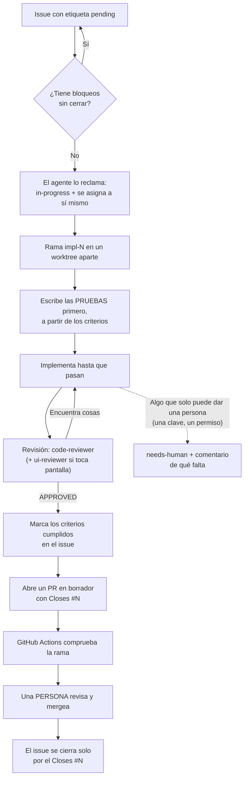
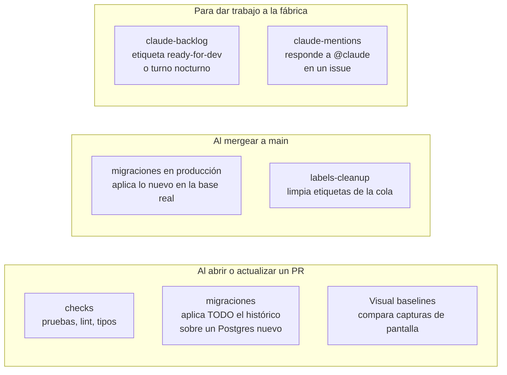
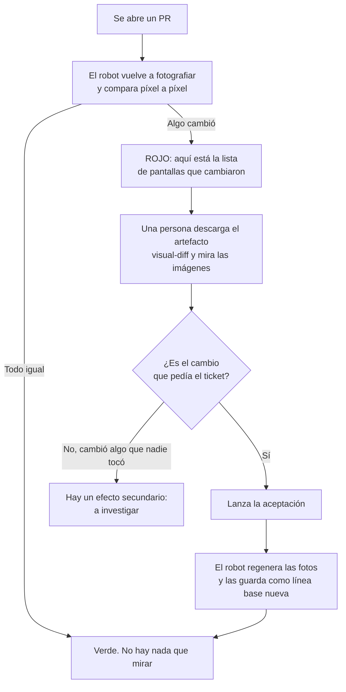
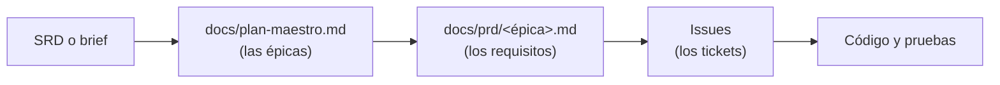

# Cómo funciona la fábrica

Guía para el equipo. Explica qué hace cada pieza, quién decide qué, y cómo
trabajar varias personas a la vez sin pisarse.

## En una frase

Los tickets viven en GitHub. Un agente los implementa uno por uno en su propia
rama, escribiendo las pruebas antes que el código. GitHub comprueba cada rama
en sus servidores. Una persona revisa y mergea. Nada entra a `main` sin que
alguien diga que sí.

## Las piezas

| Pieza                                | Qué es                                                                  |
| ------------------------------------ | ----------------------------------------------------------------------- |
| **Issues de GitHub**                 | La cola de trabajo. Cada uno lleva criterios de aceptación verificables |
| **Etiquetas**                        | El estado de la cola: `pending`, `in-progress`, `needs-human`           |
| **Tablero (Project 5)**              | La misma información en columnas, para mirarla de un vistazo            |
| **`scripts/process-backlog.sh`**     | Arranca un agente en tu máquina y le da un ticket                       |
| **Worktrees** (`.claude/worktrees/`) | Una copia aislada del repositorio por ticket, para que no choquen       |
| **GitHub Actions**                   | Los robots que comprueban cada rama en los servidores de GitHub         |
| **`factory-models.json`**            | Qué modelo usa cada pieza (el que implementa, los que revisan)          |

## El ciclo de un ticket



Dos reglas que no se saltan:

- **Las pruebas van antes que el código.** Si un ticket no se puede escribir
  como "dado esto, cuando aquello, entonces esto otro", no está listo para
  trabajarse.
- **Nadie mergea su propio trabajo.** El agente abre el PR en borrador. Mergea
  una persona.

## Quién decide qué

| Decisión                                | Quién                                            |
| --------------------------------------- | ------------------------------------------------ |
| Qué se construye y en qué orden         | El equipo                                        |
| Cómo se implementa un ticket ya escrito | El agente                                        |
| Si el código cumple los estándares      | El agente revisor, y luego la persona que mergea |
| Si una pantalla se ve bien              | Una persona, mirando las capturas                |
| Qué entra a `main`                      | Una persona                                      |
| Qué se aplica en la base de producción  | Un robot, pero solo después del merge            |

## Los flujos de GitHub Actions

Son siete y hacen tres cosas distintas.



Por qué corren en GitHub y no en la máquina de cada quien: porque en tu
portátil tienes tu sistema operativo, tus versiones y tu suerte. En el
servidor, todos los cambios se prueban en las mismas condiciones. Lo que pasa
en CI es lo que cuenta.

`migraciones` merece una mención aparte: no aplica solo la migración nueva,
sino **todas desde la primera**, sobre una base vacía. Así se descubre si algo
de hoy rompe una migración de hace seis meses.

## La comparación visual, y por qué alguien tiene que aceptarla

Las pruebas normales comprueban comportamiento. Ninguna comprueba si la
pantalla se ve bien. Para eso, la suite fotografía cada pantalla en tres
anchos, en tema claro y oscuro, y guarda esas imágenes en el repositorio. Son
la **línea base**: el acuerdo de cómo se ve la aplicación hoy.



**Rojo no significa error. Significa "esto cambió, mira si querías que
cambiara".** Si tocaste la ficha del miembro y cambian capturas de la ficha,
perfecto. Si cambian también las del calendario, ahí hay algo que no sabías,
y casi siempre es un estilo global o un componente compartido.

Cómo se revisa, en concreto:

1. Entra a la corrida roja y descarga el artefacto `visual-diff`.
2. Dentro hay una carpeta por captura que falló. **Todo lo que está ahí falló**:
   lo que pasó no se guarda. Las carpetas dicen "approved" porque el test se
   llama "matches approved baseline", no porque estén aprobadas.
3. Las carpetas terminadas en `-retry1` y `-retry2` son reintentos de la misma
   captura. Se ignoran.
4. En cada carpeta hay tres imágenes: `-expected` (antes), `-actual` (ahora) y
   `-diff` (las dos superpuestas, con lo distinto en rojo). **Abre el `-diff`**.

Para no abrirlas una por una, desde la carpeta descomprimida:

```bash
# qué estados fallaron, sin repetidos ni reintentos
find . -name "*-diff.png" | grep -v retry | sed 's|.*/||;s|-diff.png||' | sort -u
```

Cada estado aparece hasta seis veces (tres anchos por dos temas). Basta abrir
un diff por estado, y solo mirar el resto si algo parece raro.

Por qué la aceptación la hace una persona y no el robot: si el programa
pudiera aprobar sus propias capturas, la prueba no defendería nada, porque
cualquier desastre visual se aprobaría solo.

### Un caso real, del 23 de septiembre de 2026

El ticket #272 cambiaba la ficha del miembro. La comparación falló en una
captura de la pantalla de **grupos**, que el ticket no tocaba. Al abrir el
diff, los 135 píxeles distintos estaban todos en la campana de avisos.

Causa: desde que existe la campana, sale en todas las pantallas, y su número
dependía de los avisos que el usuario de prueba hubiera acumulado durante esa
corrida. Cada cambio de rol de otra prueba le creaba uno. Es decir, cualquier
captura cambiaba sola de una corrida a otra.

Se arregló sirviendo una campana vacía en las capturas de las demás pantallas.
Nadie lo habría visto de otra forma: el programa no estaba roto, simplemente se
veía distinto cada vez.

## Trabajar varias personas a la vez

Sí se puede. El modelo que usamos es **cada quien en su máquina, repartidos por
épicas**.

```mermaid
flowchart TD
    subgraph A["Ana, épica E7"]
        A1["git checkout main<br/>git pull --ff-only"] --> A2["ONLY_MINE=1 bash scripts/process-backlog.sh"]
        A2 --> A3["Worktree impl-91 en SU portátil"]
    end

    subgraph B["Beto, épica E9"]
        B1["git checkout main<br/>git pull --ff-only"] --> B2["ONLY_MINE=1 bash scripts/process-backlog.sh"]
        B2 --> B3["Worktree impl-104 en SU portátil"]
    end

    A3 --> PR1["PR impl-91"]
    B3 --> PR2["PR impl-104"]
    PR1 --> M["main"]
    PR2 --> M
    M -. "los demás actualizan<br/>su main y rebasan" .-> A1
    M -. .-> B1
```

Máquinas distintas no se estorban: cada portátil tiene su puerto y sus
worktrees. Lo que sí se comparte es la base de datos de desarrollo y el propio
`main`, y de ahí salen las tres reglas de abajo.

> **Carril de la nube (pendiente).** `claude-backlog.yml` permite etiquetar un
> issue `ready-for-dev` para que el trabajo ocurra en un servidor de GitHub, sin
> usar la máquina de nadie. A día de hoy no funciona: sus últimas ejecuciones se
> saltaron sin hacer nada. Hay que depurarlo antes de contar con él.

### Empezar siempre desde un `main` al día

Esto es lo que más se olvida. **El worktree nace de tu `main` local, no del de
GitHub.** Si tu `main` tiene dos días, el agente empieza a trabajar sobre código
viejo y el conflicto llega al final, que es cuando más cuesta.

Antes de lanzar cualquier ticket:

```bash
git checkout main
git pull --ff-only
ONLY_MINE=1 MAX_ISSUES=1 bash scripts/process-backlog.sh
```

Si tu rama lleva horas abierta y alguien mergeó mientras tanto, ponla al día
desde su worktree antes de pedir el merge:

```bash
cd .claude/worktrees/impl-N
git fetch origin
git rebase origin/main
```

El agente ya hace ese rebase antes de abrir el PR. El que hay que hacer a mano
es el de después, cuando el PR se queda esperando.

### El día a día de los merges

- **Mergea seguido y pequeño.** Dos PR de un día cada uno casi nunca chocan.
  Dos PR de una semana chocan siempre.
- **El que mergea avisa.** Es la señal para que los demás actualicen su `main`
  y rebasen lo que tengan abierto.
- **Squash y borrar la rama.** Un commit por ticket en `main`, con el número del
  issue en el título.
- **Si hay dos PR listos a la vez**, entra primero el que toque menos archivos
  compartidos. El otro rebasa encima y vuelve a mirar sus checks.
- **Nadie mergea a ciegas después de un rebase.** Rebasar cambia el código que
  CI probó, así que hay que esperar a que los checks vuelvan a ponerse verdes.

### Los tres conflictos que sí hay que planear

1. **Las migraciones se numeran solas y las dos quieren el mismo número.** Si
   Ana y Beto añaden `0021_*.sql` a la vez, git no avisa (son archivos con
   nombres distintos) pero el orden queda ambiguo. Regla: antes de empezar un
   ticket con migración, mira el último número en `supabase/migrations/`; si
   alguien mergeó el tuyo mientras trabajabas, renómbralo al siguiente libre
   antes de pedir el merge.
2. **Las capturas de pantalla.** Si dos ramas cambian las mismas pantallas, la
   segunda tendrá que rebasar y volver a aceptar líneas base. Cuesta una vuelta
   de diez minutos, no es grave, pero conviene no repartir dos tickets de la
   misma pantalla a la vez.
3. **`package-lock.json`.** Dos ramas que añaden dependencias chocan ahí. Se
   resuelve tomando el archivo de `main` y corriendo `npm install` otra vez, no
   editándolo a mano.

### Cómo se evita que dos personas tomen el mismo ticket

El reparto va por **assignee**, no por buena voluntad:

- Al arrancar, el agente se asigna el issue y le pone `in-progress`.
- Al buscar trabajo, salta cualquier issue asignado a otra persona.
- Con `ONLY_MINE=1` solo mira los tuyos, así que nunca toca el pozo común.
- Para repartir una épica entera: `bash scripts/assign-epic.sh <épica> <usuario>`.
  Asignar la épica en GitHub no sirve, porque sus sub-issues no heredan el
  dueño.

### Cómo se evita que dos personas tomen el mismo ticket

El reparto va por **assignee**, no por buena voluntad:

- Al arrancar, el agente se asigna el issue y le pone `in-progress`.
- Al buscar trabajo, salta cualquier issue asignado a otra persona.
- Con `ONLY_MINE=1` solo mira los tuyos, así que nunca toca el pozo común.
- Para repartir una épica entera: `bash scripts/assign-epic.sh <épica> <usuario>`.
  Asignar la épica en GitHub no sirve, porque sus sub-issues no heredan el
  dueño.

### Qué se puede hacer en paralelo y qué no

| Situación                                        | ¿En paralelo? | Por qué                                                                                                                    |
| ------------------------------------------------ | ------------- | -------------------------------------------------------------------------------------------------------------------------- |
| Tickets de épicas distintas, archivos distintos  | Sí            | Es el caso normal y para el que está pensado todo                                                                          |
| Backend de una épica y pantallas de otra         | Sí            | No se tocan                                                                                                                |
| Dos tickets que **cambian las mismas pantallas** | Con cuidado   | El segundo tendrá que rebasar y aceptar las capturas otra vez. Cuesta una vuelta de más                                    |
| Dos tickets que **añaden una migración**         | Con cuidado   | Los dos querrán el mismo número (`0021_…`). El segundo tiene que renumerar antes de mergear                                |
| Dos tickets que tocan el mismo componente        | Mejor no      | Conflictos de merge que resuelve una persona a mano                                                                        |
| Un ticket y otro que depende de él               | No            | Para eso está la etiqueta `blocked-by-N`: el segundo no sale de la cola hasta que el primero cierra                        |
| Dos agentes en la **misma máquina**              | No            | Se pelean por el puerto de la aplicación y por los worktrees. En máquinas distintas no pasa                                |
| Muchos a la vez contra la base de desarrollo     | Con cuidado   | Supabase limita los inicios de sesión por minuto, y las pruebas de integración empiezan a fallar por eso, no por el código |

Regla práctica para planear una tanda: **reparte por épicas, no por tickets
sueltos**. Dos personas en dos épicas distintas casi nunca chocan. Dos
personas dentro de la misma épica chocan casi siempre, porque una épica es,
por definición, un conjunto de tickets que tocan las mismas pantallas.

### Cómo se manejan los PRs

- **Una rama por ticket**, siempre `impl-N`, y un solo PR por rama.
- **El PR nace en borrador.** El agente lo abre así a propósito: dice "esto
  está listo para mirar", no "esto está listo para entrar".
- **El cuerpo del PR lleva `Closes #N`**, lo que cierra el issue al mergear.
  También lleva un resumen, la justificación de cualquier dependencia nueva y
  una sección **⚠ Not verified** con lo que no se pudo comprobar. Esa sección
  es lo primero que hay que leer.
- **Antes de abrirlo, la rama se pone al día con `main`.** Si aparece un
  conflicto que el agente no puede resolver con certeza, para y lo dice, en vez
  de adivinar.
- **Mergea una persona**, con squash, y se borra la rama. La única excepción es
  la etiqueta `auto-merge`, que solo pone un humano y a propósito, para trabajo
  mecánico.
- **Si un PR se queda en rojo por algo que el agente no puede arreglar**
  (una clave que falta, un permiso), el issue queda `needs-human` con un
  comentario de qué falta exactamente y dónde se consigue. No se reintenta a
  ciegas.

### Qué mirar antes de mergear

1. La sección **⚠ Not verified** del PR.
2. Que los criterios del issue estén marcados, y que lo estén porque hay una
   prueba que lo respalda.
3. Los checks en verde: `checks`, `migraciones` y la comparación visual.
4. Si cambian capturas, las imágenes del `visual-diff`.
5. Si hay una dependencia nueva, su justificación de una línea.

## Cómo se planea

La cadena tiene que quedar trazable en el repositorio, sin pasos que existan
solo en una conversación:



Crear issues es el único paso que nunca es automático: quien planea enseña la
tabla de lo que va a crear y espera un sí. Crear cincuenta issues es fácil;
borrarlos, no.

## Para empezar, si eres nuevo en el equipo

1. Instala lo básico: Node (la versión de `.nvmrc`), `gh`, y `npm install`.
2. Copia `.env.local` (te lo pasa alguien del equipo: nunca va al repositorio).
3. Lee `CLAUDE.md`: son las reglas que sigue el agente, y valen igual para las
   personas.
4. Coge un ticket de tu épica: asígnatelo y córrelo con
   `ONLY_MINE=1 MAX_ISSUES=1 bash scripts/process-backlog.sh`, siempre con el
   `main` recién actualizado.
5. Cuando termine, revisa su PR con la lista de arriba.
