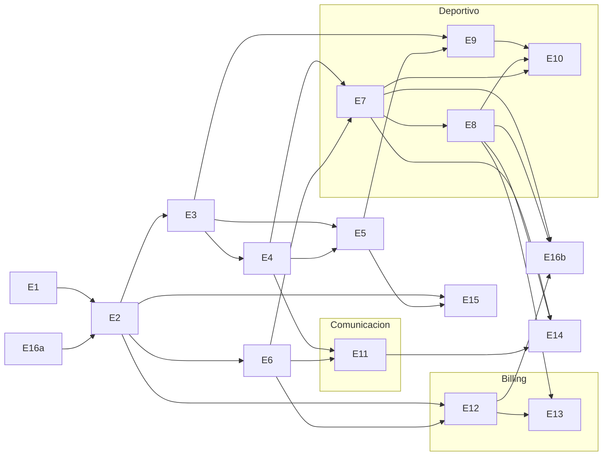

# Plan maestro — Release 1

Plataforma web del club Victoria Seadragons (rugby subacuático, Melbourne).
Fuente: `docs/SRD_Victoria_Seadragons_Club_Platform.md` (v1.4). Cada epic es
un issue de GitHub con label `epic`; sus tickets ejecutables se crean como
sub-issues al aprobar el PRD del epic (`docs/prd/<epic>.md`). Los epics no
llevan label `pending` y no son elegibles directos para la cola de la
fábrica: solo sus tickets lo son.

## Epics

| Epic                                    | Alcance / FRs                                                                                                                                                                                                                                                  | Tamaño        | Depende de        | Issue     |
| --------------------------------------- | -------------------------------------------------------------------------------------------------------------------------------------------------------------------------------------------------------------------------------------------------------------- | ------------- | ----------------- | --------- |
| **E1** — Fundación técnica              | Esquema base con `club_id` + RLS, convención API v1, tabla `audit_log`, app shell + tema claro/oscuro, tokens de marca y mockups del prototipo. FR-079 · NFR-009, NFR-010 · CON-002, CON-004                                                                   | S (6 tickets) | —                 | #1        |
| **E2** — Autenticación y cuentas        | Signup/login email+password; estado `incomplete` y completar registro; menores con consentimiento de tutor; reset de password; sign-out. Google y Apple aplazados a Release 2 (ver nota abajo). FR-001–003, FR-006–009, FR-081–083 · INT-006 · NFR-005/007/012 | L (7)         | E1, E16a          | #2        |
| **E3** — Roles y RBAC                   | 4 roles con permission matrix aplicado en servidor (RLS + handlers, NFR-004); solicitudes de rol; cambio de rol; auditoría. FR-010–014 · NFR-004                                                                                                               | M (9)         | E2                | #3        |
| **E4** — Grupos                         | CRUD de grupos, asignación de miembros, base de targeting para eventos y noticias. FR-023–027                                                                                                                                                                  | M (5)         | E3                | #4        |
| **E5** — Directorio y perfiles          | Directorio con búsqueda/filtro/orden, alta por Admin con AUF (BR-008) e invitación por email, perfil propio editable, baja de miembro. FR-015–022, FR-084, FR-085 · BR-008                                                                                     | M (6-7)       | E3, E4            | #5        |
| **E6** — Notificaciones (core)          | Centro de notificaciones in-app, badge de no-leídas, marcar todo leído. FR-073–075                                                                                                                                                                             | S (3)         | E2                | #6        |
| **E7** — Calendario y eventos + RSVP    | Eventos puntuales y recurrentes (semanal), 4 tipos, targeting por audiencia, agenda, RSVP con agregados, notificación al crear. FR-028–037                                                                                                                     | L (6-8)       | E4, E6            | #7        |
| **E8** — Asistencia                     | Registro Present/Late/Absent por sesión, contadores en vivo, % de asistencia sobre sesiones elegibles para directorio/perfil/dashboard. FR-038–042                                                                                                             | M (4)         | E7                | #8        |
| **E9** — Evaluaciones                   | Ratings 1–10 por categoría configurable, OVR a 1 decimal, set de categorías inmutable por evaluación, visibilidad estricta Admin/Coach garantizada por RLS. FR-050–056                                                                                         | M (5)         | E3, E5            | #9        |
| **E10** — Team builder                  | Modo manual + auto-balance determinista server-side (< 2s para 30 jugadores, NFR-002), no evaluados a 5.0 virtual, swap sugerido, vista del jugador asignado. FR-043–049, FR-086 · NFR-002                                                                     | L (6)         | E7, E8, E9        | #10       |
| **E11** — Noticias y documentos         | Posts con adjuntos (PDF/doc/imagen) vía Supabase Storage, targeting a grupos, feed cronológico inverso, notificaciones. FR-057–061                                                                                                                             | M (4-5)       | E4, E6            | #11       |
| **E12** — Stripe base                   | 3 membresías en AUD (Full, Student, Casual), cargo mensual recurrente para los planes recurrentes, panel de plan, cambio de plan al siguiente ciclo, tarjeta tokenizada (NFR-006), historial, webhooks. FR-062/063/065–068 · INT-001/002/003 · NFR-006         | L (6-7)       | E2, E6            | #12       |
| **E13** — Stripe avanzado               | Packs prepagos Casual con decremento por asistencia y saldo congelado al cambiar de plan, levies one-off gestionados en Stripe, recuperación de pago fallido, aviso pre-renovación. FR-064/069–072/080/087 · INT-007                                           | L (5-6)       | E12, E8           | #13       |
| **E14** — Dashboard y búsqueda global   | Dashboard con 4 tiles + próximos eventos + últimas noticias; búsqueda global agrupada por tipo (miembros/eventos/noticias). FR-076–078                                                                                                                         | M (4)         | E7, E8, E11       | #14       |
| **E15** — Privacidad y datos personales | Aviso de privacidad en el registro, exportación de los datos del miembro, borrado o anonimización dentro de 30 días, política de retención tras la baja. NFR-011 · CON-006                                                                                     | M (4)         | E2, E5            | #15       |
| **E16a** — Entornos y despliegue        | Proyecto de Supabase de producción separado del de desarrollo, despliegue en Vercel desde `main` con preview por PR, secretos por entorno, migraciones aplicadas por CI, monitoreo de disponibilidad. NFR-003 · NFR-011                                        | M (7)         | —                 | #16       |
| **E16b** — Scheduler y prueba de carga  | `pg_cron` como scheduler con los jobs de ocurrencias recurrentes (FR-031) y aviso de renovación (FR-072), más la prueba de carga sobre un dataset sembrado de 500 miembros, 5.000 ocurrencias y 50.000 asistencias. NFR-001/008                                | M (4-5)       | E16a, E7, E8, E12 | por crear |
| **E17** — Bilingüe (inglés y español)   | Catálogo de mensajes por idioma, idioma por cookie con el navegador como respaldo, interruptor junto al del tema, pantallas y correos en inglés y español, y un test que impide que se cuele texto sin traducir. Añadido después del plan.                     | M (8)         | ninguna           | #181      |

E15 y E16 se añadieron el 23 de agosto de 2026, después del plan original, al
resolver los huecos P2, P3 y P4 de `docs/preguntas-abiertas.md`.

E17 se añadió el 16 de septiembre de 2026, también después del plan original, a
petición del dueño: el club está en Melbourne y la mayoría de sus socios habla
inglés, pero la plataforma se escribió entera en español. No depende de ningún
epic y nadie depende de ella, pero **se trabaja antes de E3**: con la
infraestructura de traducción puesta, cada pantalla que venga después nace en
los dos idiomas en vez de tener que revisarse más tarde. PRD en
`docs/prd/e17-bilingue.md`.

El 7 de septiembre de 2026, al escribir su PRD, **E16 se partió en E16a y
E16b**. El motivo es de secuencia, no de tamaño: sus jobs de `pg_cron` necesitan
las tablas de eventos (E7) y de membresías (E12), y la prueba de carga exige
sembrar miembros, ocurrencias y asistencias (E5, E7, E8). Nada de eso existe
todavía, mientras que entornos, secretos y despliegue se pueden hacer hoy y son
lo único que separa a E2 de arrancar. Mantenerlas juntas habría dejado la épica
abierta durante meses con su barra de progreso congelada. E16a conserva el issue
#16, renombrado, con sus 7 tickets (#89–#95); E16b se creará cuando sus
dependencias estén cerca.

La partición **invierte dos flechas del grafo original**, y conviene decirlo en
voz alta porque cambia lo que puede empezar cuándo. E7 y E13 dependían de E16
por el scheduler: E7 para materializar ocurrencias recurrentes (FR-031), E13
para el aviso pre-renovación (FR-072). Ese scheduler es ahora E16b, y E16b
depende de las tablas que crean E7 y E12. Leído al derecho: **E7 y E13 se
entregan sin `pg_cron`**, generando lo que necesiten en el momento de escribir,
y E16b llega después a mover esos trabajos al scheduler. Ninguno de los dos
espera ya por infraestructura. Lo único que sigue esperando por E16a es E2, que
necesita un dominio estable al que apunten los enlaces de recuperación de
contraseña que salen por correo.

El 11 de septiembre de 2026, antes de escribir su PRD, **E2 recortó su alcance:
el inicio de sesión con Google y con Apple se aplaza a Release 2.** El motivo es
el costo, y es solo el de Apple: su inicio de sesión es una prestación del Apple
Developer Program, 99 dólares al año, y la regla del proyecto es que si hay que
pagar, no se hace. Google es gratis y sale igualmente, porque entregar uno solo
obliga a escribir dos veces la pantalla de completar registro y ese trabajo no
se ahorra. En Release 2 los 99 dólares dejan de ser opcionales, porque la tienda
de Apple obliga a ofrecer su inicio de sesión si la aplicación ofrece el de otro
proveedor. FR-004, FR-005, INT-004 e INT-005 quedan sin cubrir hasta entonces, y
la decisión está razonada en `docs/prd/e2-autenticacion-cuentas.md`. Lo que
esta entrega sí construye es la pieza que un proveedor externo necesita el día
que entre: el estado `incomplete` y la pantalla de completar registro, que
FR-083 pide igual para el camino de correo.

## Grafo de dependencias y carriles paralelos

E16a no depende de nadie y corre en paralelo a E1: hay que tenerlo listo antes de
E2, porque autenticar contra Supabase pide un entorno real, y antes de E7, que
necesita el scheduler para generar las ocurrencias recurrentes.

Tras completar el tronco común (E1/E16a → E2 → E3 → E4/E5 → E6) se abren **tres
carriles paralelos** que no compiten entre sí y pueden avanzar de forma
independiente en la fábrica:

1. **Deportivo:** E7 (eventos) → E8 (asistencia) y E9 (evaluaciones) → E10
   (team builder, que necesita eventos, asistencia y evaluaciones).
2. **Comunicación:** E11 (noticias y documentos).
3. **Billing:** E12 (Stripe base) → E13 (Stripe avanzado, que además consume
   la asistencia de E8 para decrementar packs Casual).

E15 (privacidad) puede entrar en cualquier momento tras E5, y conviene cerrarlo
antes de go-live porque CON-006 lo hace condición para procesar datos de
miembros. E14 (dashboard y búsqueda global) cierra Release 1 porque agrega datos
de casi todos los epics anteriores.

## Racional del orden

- **Auth y roles primero (E1 → E2 → E3).** Todo el permission matrix del SRD
  (sección 4) se aplica en servidor; sin cuentas ni RBAC no se puede construir
  ninguna funcionalidad con la seguridad correcta desde el inicio, en lugar de
  retrofitearla.
- **Notificaciones antes que sus consumidores (E6 antes de E7/E11/E12).**
  Eventos, noticias, asignación de equipos y pagos emiten notificaciones a
  través del core de E6; construirlo primero evita reescrituras en cada epic
  posterior.
- **Infraestructura en paralelo al día uno (E16a).** Sin entorno desplegado ni
  migraciones aplicadas en CI, E2 se queda sin dónde autenticar y E7 sin dónde
  correr el job de recurrencias. No tiene dependencias, así que arranca junto a
  E1 sin bloquear a nadie.
- **Stripe al final del arranque (E12/E13 tardíos).** El billing depende de
  cuentas estables y del core de notificaciones, requiere coordinar llaves de
  la cuenta Stripe del club con el comité (modo test primero), y E13 necesita
  además la asistencia de E8 para los packs casual. Se aborda cuando el
  núcleo del club ya es estable.

## Decisiones técnicas transversales

- **Stack (fijado en el bootstrap, ver `CLAUDE.md`).** Next.js 16 (App Router)
  con TypeScript estricto, Supabase (Postgres, Auth, Storage) como backend,
  Stripe desde E12, Vitest para unidad e integración y Playwright para
  regresión visual y accesibilidad. El servidor de desarrollo sirve en el
  puerto 3417, propio de este proyecto.
- **API-first bajo `app/api/v1` (CON-002).** Toda la lógica se expone como
  API REST JSON versionada desde el día uno, porque Release 2 es una app
  móvil React Native que consumirá exactamente los mismos endpoints.
- **`club_id` + RLS en toda tabla desde el día uno (NFR-009).** Aunque
  Release 1 opera un solo club (CON-004), cada tabla nace con `club_id` y
  políticas RLS, para que el multi-club futuro no requiera migración de
  datos ni reescritura de seguridad.
- **`audit_log` en E1 (NFR-010).** La tabla de auditoría forma parte de la
  fundación para que los epics posteriores (roles, membresías, pagos)
  registren acciones sensibles desde su primera versión.
- **Supabase Auth nativo para E2.** Email/password, reset e invitaciones se
  resuelven con las capacidades nativas de Supabase Auth en lugar de código
  propio, reduciendo el tamaño efectivo del epic más riesgoso. Google y Apple
  quedan aplazados a Release 2 (ver la nota de E2 arriba), y el día que entren
  lo hacen sobre el mismo servicio.
- **Resend como proveedor de correo transaccional (INT-006), decidido el 11 de
  septiembre de 2026.** Su plan gratuito da 3.000 correos al mes con tope de
  100 al día y hasta tres dominios verificados, que sobra para el volumen del
  club. Sustituye al servicio incorporado de Supabase, que manda 2 correos por
  hora y su propia documentación desaconseja para producción. Lo usan la
  recuperación de contraseña (E2), las invitaciones de socios (E5) y los avisos
  de cobro (E12). **Depende de que el club tenga dominio propio**: sin un
  remitente verificado, Resend solo escribe al correo de la propia cuenta. Esa
  compra sigue sin decidirse y es lo único que separa al correo de funcionar
  con socios reales.
- **Un solo estado de cuenta incompleta (FR-083).** Falta de datos de registro
  y falta de consentimiento de tutor comparten el estado `incomplete`, en vez
  de dos máquinas de estado paralelas.
- **Privacidad de evaluaciones por RLS (BR-007).** La visibilidad
  Admin/Coach-only de los ratings (FR-055, AC-023) se garantiza en la base
  de datos (políticas RLS), no solo en la UI: un Player nunca puede leer
  scores, ni los propios, por mucho que ataque la API directamente.
- **Stripe como única fuente de verdad de billing (CON-003).** Suscripciones,
  cargos one-off y estado de pago se leen de Stripe vía API + webhooks
  (INT-001/002/007); la plataforma nunca persiste PAN ni CVV (NFR-006).
- **`pg_cron` como scheduler (E16b).** Los trabajos programados viven en la
  base de datos, no en un cron externo, para no añadir una pieza de
  infraestructura más de la que depender.
- **El diseño manda sobre el design system (E1).** Los tokens de marca y las
  pantallas salen de `docs/Seadragons Platform.dc.html`, el handoff de Claude
  Design, no de valores por defecto.

## Trazabilidad

`docs/SRD_Victoria_Seadragons_Club_Platform.md` → este documento →
`docs/prd/<epic>.md` (uno por epic, escrito con la skill `write-prd` al
iniciar cada epic) → tickets ejecutables (`write-ticket`, sub-issues del
epic) → código + tests.

Las decisiones que cerraron los bloqueadores de la auditoría están registradas
en `docs/preguntas-abiertas.md`, y el plan de la sesión que las cerró en
`docs/plan-sesion-2026-08-23-cierre-preguntas.md`.

## Estado

Todos los epics están **Pendientes** salvo anotación en contrario. E1 y E16a son
los primeros en trabajarse por no tener dependencias; E1 es el único con PRD y
tickets escritos (`docs/prd/e1-fundacion-tecnica.md`).
