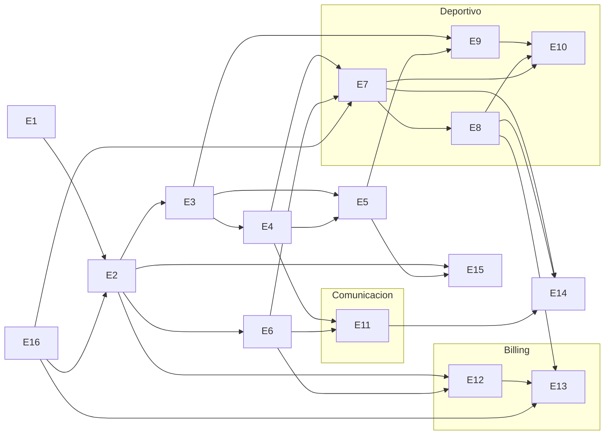

# Plan maestro — Release 1

Plataforma web del club Victoria Seadragons (rugby subacuático, Melbourne).
Fuente: `docs/SRD_Victoria_Seadragons_Club_Platform.md` (v1.4). Cada epic es
un issue de GitHub con label `epic`; sus tickets ejecutables se crean como
sub-issues al aprobar el PRD del epic (`docs/prd/<epic>.md`). Los epics no
llevan label `pending` y no son elegibles directos para la cola de la
fábrica: solo sus tickets lo son.

## Epics

| Epic                                    | Alcance / FRs                                                                                                                                                                                                                                          | Tamaño        | Depende de   | Issue |
| --------------------------------------- | ------------------------------------------------------------------------------------------------------------------------------------------------------------------------------------------------------------------------------------------------------ | ------------- | ------------ | ----- |
| **E1** — Fundación técnica              | Esquema base con `club_id` + RLS, convención API v1, tabla `audit_log`, app shell + tema claro/oscuro, tokens de marca y mockups del prototipo. FR-079 · NFR-009, NFR-010 · CON-002, CON-004                                                           | S (6 tickets) | —            | #1    |
| **E2** — Autenticación y cuentas        | Signup/login email+password, Google, Apple; estado `incomplete` y completar registro; menores con consentimiento de tutor; reset de password; sign-out. FR-001–009, FR-081–083 · INT-004/005/006 · NFR-005/007/012                                     | L (6-8)       | E1, E16      | #2    |
| **E3** — Roles y RBAC                   | 4 roles con permission matrix aplicado en servidor (RLS + handlers, NFR-004); solicitudes de rol; cambio de rol; auditoría. FR-010–014 · NFR-004                                                                                                       | M (4-5)       | E2           | #3    |
| **E4** — Grupos                         | CRUD de grupos, asignación de miembros, base de targeting para eventos y noticias. FR-023–027                                                                                                                                                          | S (3)         | E3           | #4    |
| **E5** — Directorio y perfiles          | Directorio con búsqueda/filtro/orden, alta por Admin con AUF (BR-008) e invitación por email, perfil propio editable, baja de miembro. FR-015–022, FR-084, FR-085 · BR-008                                                                             | M (6-7)       | E3, E4       | #5    |
| **E6** — Notificaciones (core)          | Centro de notificaciones in-app, badge de no-leídas, marcar todo leído. FR-073–075                                                                                                                                                                     | S (3)         | E2           | #6    |
| **E7** — Calendario y eventos + RSVP    | Eventos puntuales y recurrentes (semanal), 4 tipos, targeting por audiencia, agenda, RSVP con agregados, notificación al crear. FR-028–037                                                                                                             | L (6-8)       | E4, E6, E16  | #7    |
| **E8** — Asistencia                     | Registro Present/Late/Absent por sesión, contadores en vivo, % de asistencia sobre sesiones elegibles para directorio/perfil/dashboard. FR-038–042                                                                                                     | M (4)         | E7           | #8    |
| **E9** — Evaluaciones                   | Ratings 1–10 por categoría configurable, OVR a 1 decimal, set de categorías inmutable por evaluación, visibilidad estricta Admin/Coach garantizada por RLS. FR-050–056                                                                                 | M (5)         | E3, E5       | #9    |
| **E10** — Team builder                  | Modo manual + auto-balance determinista server-side (< 2s para 30 jugadores, NFR-002), no evaluados a 5.0 virtual, swap sugerido, vista del jugador asignado. FR-043–049, FR-086 · NFR-002                                                             | L (6)         | E7, E8, E9   | #10   |
| **E11** — Noticias y documentos         | Posts con adjuntos (PDF/doc/imagen) vía Supabase Storage, targeting a grupos, feed cronológico inverso, notificaciones. FR-057–061                                                                                                                     | M (4-5)       | E4, E6       | #11   |
| **E12** — Stripe base                   | 3 membresías en AUD (Full, Student, Casual), cargo mensual recurrente para los planes recurrentes, panel de plan, cambio de plan al siguiente ciclo, tarjeta tokenizada (NFR-006), historial, webhooks. FR-062/063/065–068 · INT-001/002/003 · NFR-006 | L (6-7)       | E2, E6       | #12   |
| **E13** — Stripe avanzado               | Packs prepagos Casual con decremento por asistencia y saldo congelado al cambiar de plan, levies one-off gestionados en Stripe, recuperación de pago fallido, aviso pre-renovación. FR-064/069–072/080/087 · INT-007                                   | L (5-6)       | E12, E8, E16 | #13   |
| **E14** — Dashboard y búsqueda global   | Dashboard con 4 tiles + próximos eventos + últimas noticias; búsqueda global agrupada por tipo (miembros/eventos/noticias). FR-076–078                                                                                                                 | M (4)         | E7, E8, E11  | #14   |
| **E15** — Privacidad y datos personales | Aviso de privacidad en el registro, exportación de los datos del miembro, borrado o anonimización dentro de 30 días, política de retención tras la baja. NFR-011 · CON-006                                                                             | M (4)         | E2, E5       | #15   |
| **E16** — Infraestructura y scheduler   | Entornos y hosting, secretos por entorno, migraciones aplicadas en CI, `pg_cron` como scheduler con los jobs de ocurrencias recurrentes (FR-031) y aviso de renovación (FR-072), prueba de carga. NFR-001/003/008                                      | M (5)         | —            | #16   |

E15 y E16 se añadieron el 23 de agosto de 2026, después del plan original, al
resolver los huecos P2, P3 y P4 de `docs/preguntas-abiertas.md`.

## Grafo de dependencias y carriles paralelos

E16 no depende de nadie y corre en paralelo a E1: hay que tenerlo listo antes de
E2, porque autenticar contra Supabase pide un entorno real, y antes de E7, que
necesita el scheduler para generar las ocurrencias recurrentes.

Tras completar el tronco común (E1/E16 → E2 → E3 → E4/E5 → E6) se abren **tres
carriles paralelos** que no compiten entre sí y pueden avanzar de forma
independiente en la fábrica:

1. **Deportivo:** E7 (eventos) → E8 (asistencia) y E9 (evaluaciones) → E10
   (team builder, que necesita eventos, asistencia y evaluaciones).
2. **Comunicación:** E11 (noticias y documentos).
3. **Billing:** E12 (Stripe base) → E13 (Stripe avanzado, que además consume
   la asistencia de E8 para decrementar packs Casual).

E15 (privacidad) puede entrar en cualquier momento tras E5, y conviene cerrarlo
antes de go-live porque CON-006 lo hace condición para procesar datos de
miembros. E14 (dashboard y búsqueda global) cierra Release 1 porque agrega datos
de casi todos los epics anteriores.

## Racional del orden

- **Auth y roles primero (E1 → E2 → E3).** Todo el permission matrix del SRD
  (sección 4) se aplica en servidor; sin cuentas ni RBAC no se puede construir
  ninguna funcionalidad con la seguridad correcta desde el inicio, en lugar de
  retrofitearla.
- **Notificaciones antes que sus consumidores (E6 antes de E7/E11/E12).**
  Eventos, noticias, asignación de equipos y pagos emiten notificaciones a
  través del core de E6; construirlo primero evita reescrituras en cada epic
  posterior.
- **Infraestructura en paralelo al día uno (E16).** Sin entorno desplegado ni
  migraciones aplicadas en CI, E2 se queda sin dónde autenticar y E7 sin dónde
  correr el job de recurrencias. No tiene dependencias, así que arranca junto a
  E1 sin bloquear a nadie.
- **Stripe al final del arranque (E12/E13 tardíos).** El billing depende de
  cuentas estables y del core de notificaciones, requiere coordinar llaves de
  la cuenta Stripe del club con el comité (modo test primero), y E13 necesita
  además la asistencia de E8 para los packs casual. Se aborda cuando el
  núcleo del club ya es estable.

## Decisiones técnicas transversales

- **Stack (fijado en el bootstrap, ver `CLAUDE.md`).** Next.js 16 (App Router)
  con TypeScript estricto, Supabase (Postgres, Auth, Storage) como backend,
  Stripe desde E12, Vitest para unidad e integración y Playwright para
  regresión visual y accesibilidad. El servidor de desarrollo sirve en el
  puerto 3417, propio de este proyecto.
- **API-first bajo `app/api/v1` (CON-002).** Toda la lógica se expone como
  API REST JSON versionada desde el día uno, porque Release 2 es una app
  móvil React Native que consumirá exactamente los mismos endpoints.
- **`club_id` + RLS en toda tabla desde el día uno (NFR-009).** Aunque
  Release 1 opera un solo club (CON-004), cada tabla nace con `club_id` y
  políticas RLS, para que el multi-club futuro no requiera migración de
  datos ni reescritura de seguridad.
- **`audit_log` en E1 (NFR-010).** La tabla de auditoría forma parte de la
  fundación para que los epics posteriores (roles, membresías, pagos)
  registren acciones sensibles desde su primera versión.
- **Supabase Auth nativo para E2.** Email/password, Google, Apple, reset e
  invitaciones se resuelven con las capacidades nativas de Supabase Auth en
  lugar de código propio, reduciendo el tamaño efectivo del epic más
  riesgoso.
- **Un solo estado de cuenta incompleta (FR-083).** Falta de datos de registro
  y falta de consentimiento de tutor comparten el estado `incomplete`, en vez
  de dos máquinas de estado paralelas.
- **Privacidad de evaluaciones por RLS (BR-007).** La visibilidad
  Admin/Coach-only de los ratings (FR-055, AC-023) se garantiza en la base
  de datos (políticas RLS), no solo en la UI: un Player nunca puede leer
  scores, ni los propios, por mucho que ataque la API directamente.
- **Stripe como única fuente de verdad de billing (CON-003).** Suscripciones,
  cargos one-off y estado de pago se leen de Stripe vía API + webhooks
  (INT-001/002/007); la plataforma nunca persiste PAN ni CVV (NFR-006).
- **`pg_cron` como scheduler (E16).** Los trabajos programados viven en la
  base de datos, no en un cron externo, para no añadir una pieza de
  infraestructura más de la que depender.
- **El diseño manda sobre el design system (E1).** Los tokens de marca y las
  pantallas salen de `docs/Seadragons Platform.dc.html`, el handoff de Claude
  Design, no de valores por defecto.

## Trazabilidad

`docs/SRD_Victoria_Seadragons_Club_Platform.md` → este documento →
`docs/prd/<epic>.md` (uno por epic, escrito con la skill `write-prd` al
iniciar cada epic) → tickets ejecutables (`write-ticket`, sub-issues del
epic) → código + tests.

Las decisiones que cerraron los bloqueadores de la auditoría están registradas
en `docs/preguntas-abiertas.md`, y el plan de la sesión que las cerró en
`docs/plan-sesion-2026-08-23-cierre-preguntas.md`.

## Estado

Todos los epics están **Pendientes** salvo anotación en contrario. E1 y E16 son
los primeros en trabajarse por no tener dependencias; E1 es el único con PRD y
tickets escritos (`docs/prd/e1-fundacion-tecnica.md`).
